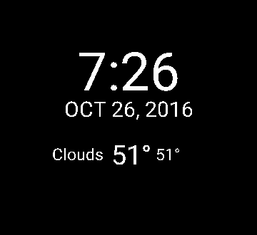
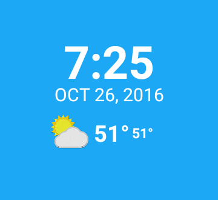

# Go-Ubiquitous

&nbsp

## Features

## Setup
This project requires a Open Weather Map API key, which you can obtain from [Open Weather Map site](https://openweathermap.org/api). After you obtain an Open Weather Map key enter it in the App build.gradle file at:
<pre><code>
android {
   ...
    buildTypes.each {
        it.buildConfigField 'String', 'OPEN_WEATHER_MAP_API_KEY', <b>'"Place your Open Weather Map Key here"'</b>
    }
}
</code></pre>
<b>Note:</b> Place key inside the double quotes. 

