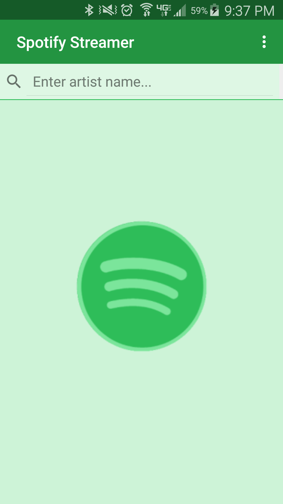
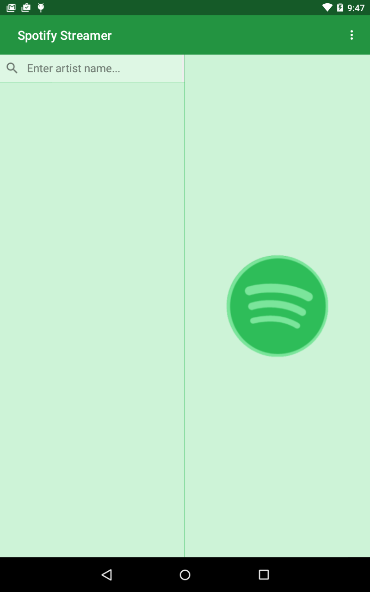
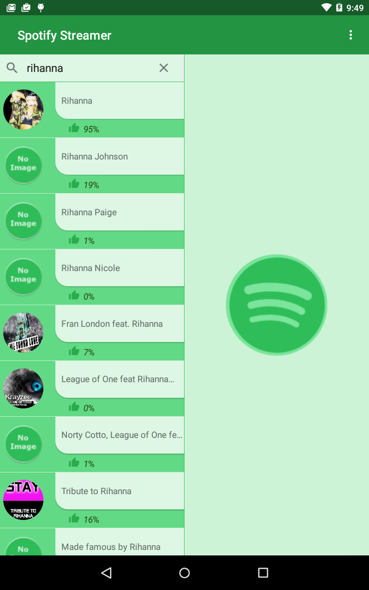
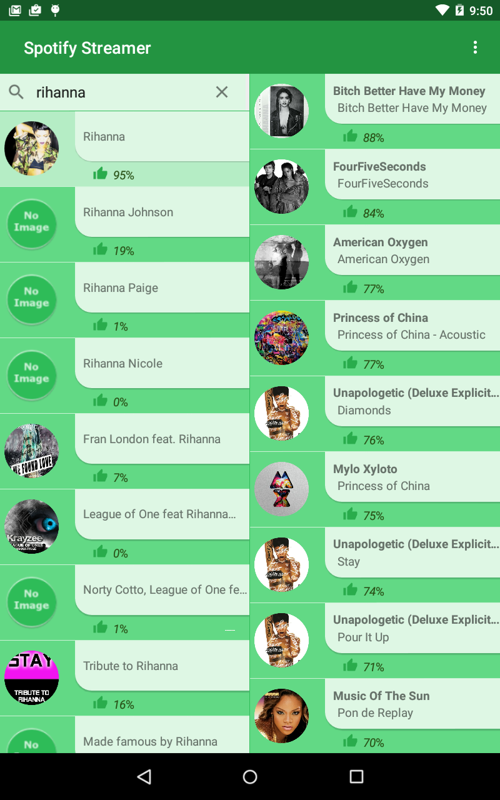
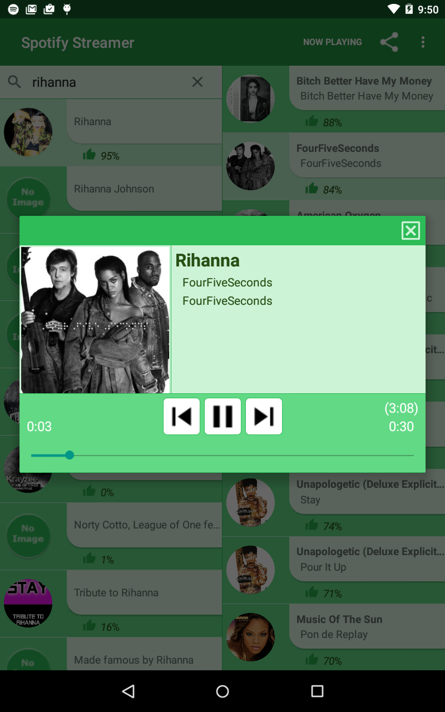

# Spotify-Streamer
This project was an assignment for Udacity's Android Nanodegree. 

The project base requirements were to design a phone and tablet app that:
- Queried Spotify's WebAPI to retrieve Top 10 tracks for a particular artist. 
- Plays 30-second preview of selected track
- Provide play, pause, previous and next buttons 
- Allow scrub bar modification (timeline slider)

For exceeding specifications requirements:
- Provide a "Now Playing" button to view player dialog
- Share playing track
- Play track remotely through a URL 
- Change country Top 10 track reference
- Provide play, pause, previous and next buttons as a notification
- Provide play, pause, previous and next buttons on screen lock 
- Ability to enable/disable notification in dropdown and lock screen

## Phone Screenshot

## Tablet Screenshot

